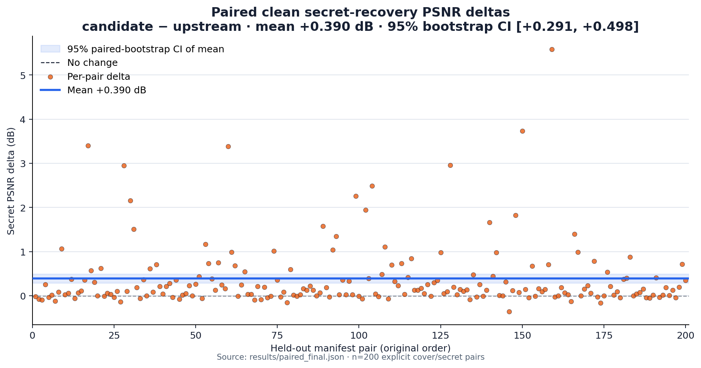
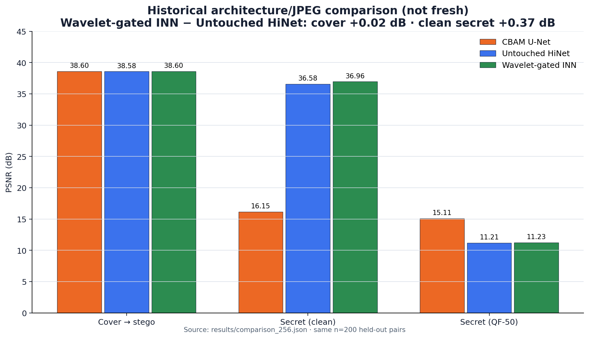
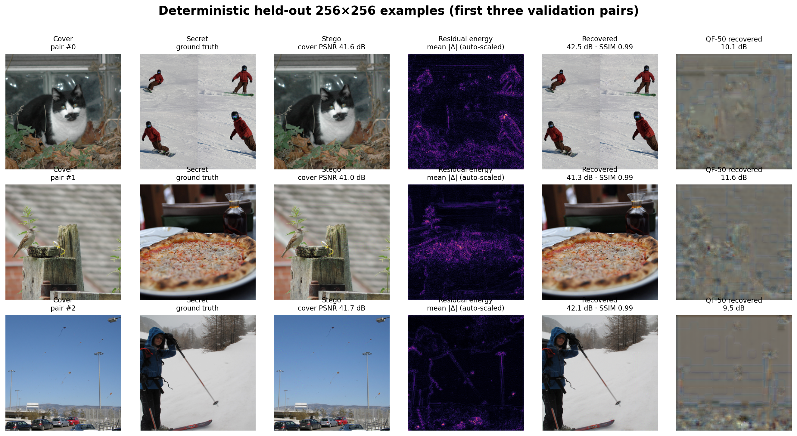
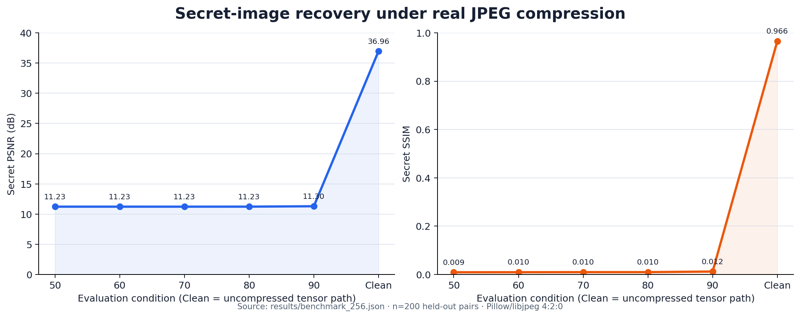

# Wavelet-Gated Invertible Image Steganography

> Hide one full **256×256 RGB secret image** inside a **256×256 RGB cover**, then recover it from the stego image alone.

[](https://github.com/Wolfy024/Stego_1/actions/workflows/ci.yml)
[](https://www.python.org/)
[](https://pytorch.org/)
[](#payload)

On a frozen **fresh final cohort** of 200 cover/secret pairs (400 unique
images), the selected checkpoint reaches **38.762 dB cover PSNR** and
**37.116 dB recovered-secret PSNR**. Every final image was excluded from the
historical 2,000-image adaptation/evaluation pool.

| Fresh-final result | Untouched HiNet | Selected gates | Paired delta (95% bootstrap CI) |
|---|---:|---:|---:|
| Cover PSNR ↑ | 38.743 dB | **38.762 dB** | **+0.019 dB** `[+0.015, +0.023]` |
| Cover SSIM ↑ | 0.9657 | **0.9659** | +0.00023 |
| Secret PSNR ↑ | 36.726 dB | **37.116 dB** | **+0.390 dB** `[+0.291, +0.498]` |
| Secret SSIM ↑ | 0.9646 | **0.9662** | +0.00168 |

Secret PSNR improved on **153/200 pairs (76.5%)**. The interval is a seeded
10,000-sample paired bootstrap over this fixed final cohort; it does not
measure training-seed variability. Evaluation is one pair at a time in
float32 with autocast and TF32 disabled.



The model hides a full 256×256 RGB image—not a 96-bit watermark—and recovers
it from the stego image alone. Results support a clean-channel engineering
improvement over the disclosed upstream checkpoint; they are not a claim of
academic state of the art.

## What changed

The original CBAM U-Net baseline preserved the cover but plateaued at 16.15 dB
clean secret recovery. The selected model replaces that lossy encoder/decoder
path with a reversible mapping inspired by
[HiNet (ICCV 2021)](https://openaccess.thecvf.com/content/ICCV2021/html/Jing_HiNet_Deep_Image_Hiding_by_Invertible_Network_ICCV_2021_paper.html):

```text
cover ── Haar DWT ──┐
                    ├─ 16 reversible coupling blocks ─ IWT ─ stego
secret ─ Haar DWT ──┘                              └──── latent

stego ─ Haar DWT ──┐
                    ├─ inverse coupling blocks ─ IWT ─ recovered secret
fixed latent z ─────┘
```

The selected checkpoint adds a small, project-specific adapter to that
backbone:

- **CBAM-style coupling attention** reweights dense features inside each
  reversible subnet.
- **Sample-adaptive wavelet gates** independently modulate LL, HL, LH, and HH
  residual bands.
- Both modules are identity-initialized, so a compatible checkpoint can be
  imported without changing its initial output.
- A gates-only adaptation mode freezes the imported coupling backbone and
  updates **123,024 attention/gate parameters**.
- Evaluation uses a fixed seeded Gaussian latent, so reveal is deterministic
  and requires no user-supplied key.

The selected wavelet-gate adapter is the project-specific spin that survived
the held-out comparison. This is an engineering extension, not a claim that
attention or wavelet gating is academically new. The inference path has 4.17M
parameters; the complete checkpoint is 4.87M parameters including the
optional PatchGAN critic.

### Experimental research mechanism (not selected)

The repository also contains an optional **energy-preserving Haar-band
router**. Four per-sample band-energy descriptors predict the six independent
entries of a skew-symmetric matrix; a Cayley transform turns it into a 4×4
orthogonal routing matrix. The router is identity-initialized and preserves L2
energy while redistributing information across LL/HL/LH/HH. It adds **4,512
trainable parameters** across the network.

Two ablations on the fixed 100-pair development cohort were rejected:

| Router dev ablation | Cover PSNR Δ | Secret PSNR Δ (95% paired CI) | Decision |
|---|---:|---:|---|
| v1, balanced | +0.007 dB | +0.015 dB `[-0.030, +0.065]` | Reject: secret CI crosses zero; secret SSIM −0.000013 |
| v2, secret-weighted | −0.048 dB | +0.065 dB `[-0.011, +0.144]` | Reject: cover regressed; secret CI crosses zero |

The router was **never evaluated on the final cohort**. It remains an honest
experimental mechanism and negative result, not the selected model and not a
claim of first publication or SOTA novelty. The compact ablation record is in
[`results/router_ablation_dev.json`](results/router_ablation_dev.json).

## Payload

The primary task is full-image hiding, **not a 96-bit watermark**:

- cover: `[B, 3, 256, 256]`
- secret: `[B, 3, 256, 256]`
- stego: `[B, 3, 256, 256]`
- recovered secret: `[B, 3, 256, 256]`

That is a nominal raw payload of 1,572,864 bits per image
(`256 × 256 × 3 × 8`). Recovery is learned and lossy; the count is not a
claim of lossless capacity. The older bit-payload mode remains available as an
optional U-Net configuration.

## Results

### Fresh clean-channel final evaluation

- **Data discovered:** 5,000 COCO val2017 images + 100 DIV2K validation images
- **Historical pool excluded:** all 2,000 seed-2026 images used by the original
  adaptation/evaluation workflow
- **Fresh final cohort:** 200 explicit pairs / 400 unique images, with no image
  reused across cover/secret roles or the 100-pair development cohort
- **Source composition:** 391 COCO images and 9 DIV2K images; this is a pooled,
  COCO-heavy cohort, not a balanced cross-dataset benchmark
- **Input and secret:** full 256×256 RGB images
- **Aggregation:** one-pair FP32 PSNR/SSIM, then arithmetic mean over 200 pairs
- **Uncertainty:** 10,000-sample paired percentile bootstrap, seed 2026
- **Selected checkpoint:** official HiNet warm start + 100 local gates-only steps

| Model on fresh final pairs | Cover PSNR | Cover SSIM | Secret PSNR | Secret SSIM |
|---|---:|---:|---:|---:|
| Untouched HiNet | 38.7429 | 0.96571 | 36.7258 | 0.96457 |
| **Wavelet-gated INN** | **38.7619** | **0.96594** | **37.1156** | **0.96625** |

The selected adapter is a strict mean Pareto improvement on these two clean
objectives: cover **+0.0191 dB** (95% CI `[+0.0149, +0.0231]`) and secret
**+0.3898 dB** (95% CI `[+0.2910, +0.4981]`). Pair-level records, checkpoint
hashes, image hashes, and the protocol live in
[`results/paired_final.json`](results/paired_final.json); the content-addressed
cohort is [`results/eval_manifests/final.json`](results/eval_manifests/final.json).

### Historical architecture and JPEG cohort

The older 200-pair split comes from the same seeded 2,000-image pool used in
the adaptation workflow, so it is **not fresh final evidence**. It is retained
only for the legacy architecture comparison and real-JPEG stress test.

| Model on historical cohort | Cover PSNR | Clean secret PSNR | QF-50 secret PSNR |
|---|---:|---:|---:|
| CBAM U-Net, 3,900 steps | 38.603 | 16.155 | **15.111** |
| Untouched HiNet warm start | 38.584 | 36.582 | 11.205 |
| **Wavelet-gated INN, 100 gate steps** | **38.604** | **36.955** | 11.227 |

The selected model improves historical clean secret PSNR by 0.373 dB over
untouched HiNet and 20.801 dB over the CBAM U-Net, but none of these historical
deltas replace the fresh paired result above. All three INN cells use float32
tensors with autocast disabled; the legacy TF32 setting was not recorded.
QF-50 uses the same real Pillow/libjpeg path.



### Qualitative examples

The figure uses the first three validation pairs in deterministic order; they
were not cherry-picked. The residual view is auto-scaled for visibility.



### JPEG stress test



On the historical cohort, every tested real-JPEG quality collapses selected-
model recovery to roughly 11.2 dB; QF-50 is **11.227 dB / 0.0093 SSIM**. A
robust version would need to move away from brittle full-band invertibility—for
example, a redundancy/error-correction path or a robust invertible objective
such as the direction explored by
[RIIS (CVPR 2022)](https://openaccess.thecvf.com/content/CVPR2022/html/Xu_Robust_Invertible_Image_Steganography_CVPR_2022_paper.html).

Machine-readable evidence lives in
[`results/paired_final.json`](results/paired_final.json) (fresh clean paired
comparison), [`results/benchmark_256.json`](results/benchmark_256.json)
(historical clean/JPEG aggregate), and
[`results/validation_report.md`](results/validation_report.md) (independent
checks).

## Reproduce

### 1. Install

```bash
git clone https://github.com/Wolfy024/Stego_1.git
cd Stego_1
python -m venv .venv
source .venv/bin/activate
python -m pip install --upgrade pip
python -m pip install -e ".[dev]"
```

Install the correct PyTorch build for your CUDA version first if the default
wheel is not appropriate. CPU smoke tests work; training the 16-block model is
GPU-oriented.

### 2. Download data

```bash
python scripts/download_datasets.py coco-val2017 div2k-valid
python scripts/profile_data.py \
  --data-dir data/coco/val2017 data/div2k/DIV2K_valid_HR
```

The helper uses the official
[COCO](https://cocodataset.org/#download) and
[DIV2K](https://data.vision.ee.ethz.ch/cvl/DIV2K/) archives and stores them
under ignored `data/` paths.

### 3. Import the disclosed warm start

Download `model.pt` from the
[official HiNet trained-model folder](https://drive.google.com/drive/folders/1l3XBFYPMaNFdvCWyOHfB2qIPkpjIxZgE?usp=sharing)
to `external/hinet-model/model.pt`, then run:

```bash
python scripts/import_hinet_checkpoint.py \
  --source external/hinet-model/model.pt \
  --output-dir runs/invertible_warmstart
```

The importer maps 480 compatible dense-convolution tensors. The benchmark used
official repository commit
`5c2682a6be3fc52354b816c0269c05061e30b998` and source checkpoint SHA-256
`d89a83e0e549e9bddde301d631b8614cc724c8d9f11feaf2221791aa02c122a7`.
The upstream checkpoint is not redistributed here; obtain it from its authors
and follow their terms.

The importer seeds all local-only parameters before constructing the model.
Exact published evidence remains bound to the image/checkpoint hashes in the
paired artifact; hardware and library differences can still introduce small
numeric changes. Confirm upstream permission before redistributing adapted
weight files.

### 4. Adapt only the new modules

```bash
python -m stego.cli train \
  --warm-start runs/invertible_warmstart/latest.pt \
  --data-dir data/coco/val2017 data/div2k/DIV2K_valid_HR \
  --output-dir runs/invertible_gates_only \
  --max-steps 100 \
  --cover-weight 20 \
  --secret-weight 5 \
  --low-frequency-weight 10 \
  --gates-only
```

### 5. Recreate the fresh manifests and paired final comparison

Create development and final cohorts only from images outside the complete
historical 2,000-image pool:

```bash
python scripts/create_eval_manifests.py \
  --data-dir data/coco/val2017 data/div2k/DIV2K_valid_HR \
  --output-dir results/eval_manifests

python scripts/compare_checkpoints.py \
  --baseline runs/invertible_warmstart/latest.pt \
  --candidate runs/invertible_gates_only/latest.pt \
  --manifest results/eval_manifests/final.json \
  --output results/reproduced_paired_final.json \
  --device cuda
```

The committed manifest fixes pair order and records every image hash. The
comparison tool records both checkpoint hashes, evaluates one pair at a time
in FP32 with autocast/TF32 disabled, and emits pair-level metrics plus the
seeded paired-bootstrap interval.

### 6. Reproduce the historical JPEG stress test, render, and validate

```bash
python -m stego.cli evaluate \
  --checkpoint runs/invertible_gates_only/latest.pt \
  --data-dir data/coco/val2017 data/div2k/DIV2K_valid_HR \
  --jpeg-qualities 50 60 70 80 90 \
  --output results/reproduced_benchmark_256.json

python scripts/render_examples.py \
  --checkpoint runs/invertible_gates_only/latest.pt \
  --data-dir data/coco/val2017 data/div2k/DIV2K_valid_HR

python scripts/plot_results.py

python scripts/validate_results.py \
  --checkpoint runs/invertible_gates_only/latest.pt \
  --warmstart runs/invertible_warmstart/latest.pt \
  --history runs/invertible_gates_only/history.csv
```

Use the final cohort once for the final clean comparison; router/model choices
belong on [`results/eval_manifests/dev.json`](results/eval_manifests/dev.json),
not the final manifest.

## Quick checks

```bash
python -m stego.cli smoke --device cpu
ruff check .
pytest
```

The fast CPU tests cover Haar round trips, invertible forward/reverse paths,
attention/router identity initialization, deterministic latent behavior, data
pairing and manifests, range-correct PSNR/SSIM, paired statistics, real and
differentiable JPEG paths, checkpoint compatibility, and configuration
validation. `validate_results.py` separately checks the selected checkpoint's
256×256 tensor shapes, FP32 evidence, adapter updates, paired checkpoint
identity, clean Pareto result, JPEG failure, and training stability.

## Repository map

```text
configs/                     reproducible U-Net, watermark, and INN configs
stego/
  invertible.py              Haar transform, gated coupling blocks, inverse
  router.py                  optional orthogonal Haar-band research router
  models.py                  selectable INN and CBAM U-Net/PatchGAN models
  training.py                AMP training, checkpointing, real-JPEG evaluation
  metrics.py                 batch-aware PSNR, SSIM, and similarity metrics
  data.py                    deterministic cover/secret pairing
  cli.py                     smoke, train, and evaluate entry points
scripts/
  create_eval_manifests.py   fresh content-addressed dev/final cohorts
  compare_checkpoints.py     paired FP32 metrics and bootstrap intervals
  download_datasets.py       credential-free official dataset downloader
  import_hinet_checkpoint.py explicit upstream tensor mapping
  plot_results.py            source-backed README charts
  render_examples.py         deterministic qualitative panel
  validate_results.py        independent evidence reconciliation
results/                     committed benchmark, audit, and chart provenance
tests/                       fast CPU regression tests
```

Key audit artifacts: [`paired_final.json`](results/paired_final.json),
[`final.json`](results/eval_manifests/final.json), and
[`router_ablation_dev.json`](results/router_ablation_dev.json). The cohort and
comparison tools are [`create_eval_manifests.py`](scripts/create_eval_manifests.py)
and [`compare_checkpoints.py`](scripts/compare_checkpoints.py).

## Honest résumé version

- Built a 4.17M-parameter invertible image-hiding model for full 256×256 RGB
  payloads, adding an identity-initialized, sample-adaptive Haar-band adapter
  to a disclosed HiNet warm start and updating only 123,024 adapter parameters.
- Reached **38.762 dB cover PSNR** and **37.116 dB recovered-secret PSNR**
  (SSIM 0.9659/0.9662) on a frozen fresh 200-pair COCO/DIV2K cohort.
- Improved secret recovery by **+0.390 dB vs untouched HiNet** with a paired
  95% bootstrap CI of **[+0.291, +0.498] dB**; secret PSNR improved on 76.5%
  of final pairs.
- Built content-addressed evaluation manifests, per-pair checkpoint comparison,
  and real-JPEG tests that exposed the current model's compression failure.

Do not call MAE similarity “extraction accuracy”; do not claim JPEG robustness,
academic novelty, independent SOTA, or a from-scratch HiNet result.

## Limitations and security

- Clean recovery assumes an unchanged tensor or lossless image path.
- JPEG, resizing, cropping, and other distribution shifts are not currently
  supported.
- “Keyless” means no user-supplied decoding key; it does **not** provide
  confidentiality, authentication, or cryptographic security.
- The paired interval measures variation across one fixed 200-pair final
  cohort, not checkpoint or training-seed variability.
- The fresh final cohort is 391/400 COCO images; DIV2K-specific and balanced
  cross-dataset generalization claims are unsupported.
- The final backbone is warm-started from public HiNet weights, not trained
  from scratch.
- The selected adapter was trained once; multi-seed adaptation evidence is not
  available.
- The historical architecture/JPEG cohort is not fresh and must not be used as
  the headline generalization result.
- The optional orthogonal router was rejected on development evidence and was
  never run on the final cohort.
- Comparisons are internal checkpoint/architecture ablations, not independent
  reproductions of published SOTA systems.

## Acknowledgment

The reversible coupling equations, Haar-domain construction, and compatible
backbone weights come from:

> Jing et al., “HiNet: Deep Image Hiding by Invertible Network,” ICCV 2021.

See the
[paper](https://openaccess.thecvf.com/content/ICCV2021/html/Jing_HiNet_Deep_Image_Hiding_by_Invertible_Network_ICCV_2021_paper.html)
and
[official implementation](https://github.com/TomTomTommi/HiNet).
